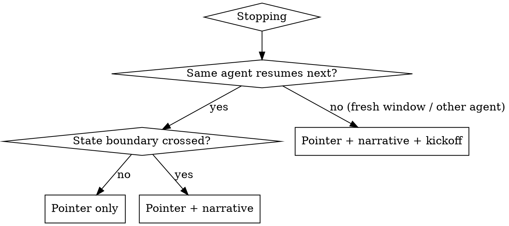

# Session handoff

A long manuscript round is picked up and put down many times, often by a fresh
context window or a different agent. The handoff is what lets the next worker
resume in one read, without re-deriving state. Leave it at every stopping point.

The core failure this prevents: a next agent that opens the project, cannot tell
what state it is in or what to do first, and re-derives everything (or guesses
paths and misses files). A good handoff makes the first action obvious and every
file findable.

## The three artifacts

Each carries the handoff a different distance. Write the ones the stop calls for.

1. **Resume pointer** (`versions/v{N}/STATE.md`, or the layer equivalent). The
   machine-clean state: exactly one state, the current item when mid-loop, the
   blocker, who or what we wait on, a timestamp, and a single concrete next
   action. Always current. This is the minimum, every session.
2. **Narrative handoff** (`HANDOFF_{date}.md` at the project root). The story: what
   exists and is verified, the findings that need attention, how to resume, the
   reproducibility rules, and what is out of scope for now. Written or refreshed
   whenever a state boundary is crossed.
3. **Directive next-agent kickoff** (`NEXT_AGENT_START_HERE.md` at the project
   root). A self-contained, imperative briefing for a fresh context window or a
   different agent. Written whenever the next worker is not this same session.

## When to write which

## The next-agent kickoff: required parts

The kickoff is the artifact most handoffs omit. It must carry all of:

1. **The task.** One paragraph: what the next agent does and where it stops.
2. **Do this first.** The session-startup sequence in order (read CLAUDE.md and
   `.layer-manifest.yml`, the ledger, STATE.md and the version pickup, then the
   working document; announce state and next action before acting).
3. **The loop, short form.** The per-item or per-step cycle, pointing to the
   authoritative version (for the edit layer, the "INSTRUCTIONS FOR CLAUDE" block
   in the MASTER_REVISION_LIST).
4. **Hard rules.** The non-negotiables: the writing skills on every drafted edit,
   house style, numbers stay inline R, one item at a time, subfolder discipline,
   no commit or push without instruction.
5. **A complete file map** (see below).
6. **Where the detailed instructions live.** Point to CLAUDE.md,
   `notes/AI_HELPER_INSTRUCTIONS.md`, the layer orchestrator skill, and the
   relevant capture or submit docs.
7. **A copy-paste kickoff prompt** (see below).

## The file map (the part most handoffs miss)

Every kickoff carries a complete file map, grouped so the next agent finds any
file in one look. Use project-relative paths, and resolve cross-layer paths from
`.layer-manifest.yml` rather than guessing. Group as:

- **Work on these**: the checklist or working document, the working qmd, the
  resume pointer, the version log.
- **Read for context**: the returned and sent DOCX, the capture artifacts, the
  reconciliation record.
- **Cross-layer (source of truth)**: the base qmd, the bibliography and CSL, the
  analysis qmds, the RData directory, the render scripts, resolved via the
  manifest.
- **Tools and templates**: the redline reference, the render and writing skills,
  the layer orchestrator skill.

Verify every path in the map resolves before you finish. A path that does not
resolve is worse than no path.

## The copy-paste kickoff prompt

End the kickoff with a short prompt the user pastes into the new window. It names
the project, says to read the kickoff first, states the current state and the
single next action, and restates the one or two non-negotiables. Keep it to a few
sentences, because the user pastes it verbatim.

## Reproducibility and house style

Apply house style to every handoff (no em dashes, American spelling, affirmative
claims, a real actor in the subject, no contractions in author-facing text). Never
freeze a manuscript number into a handoff as if it were source; numbers stay
inline R from the latest RData, and a handoff reports a count as a captured fact,
not a value to paste. Cross-layer paths come from the manifest.

## Works in both layers

- **Edit layer.** Stops at SENT, LISTED, REVIEW_DONE, REFLECTED. The kickoff points
  at `versions/v{N}/reconcile/MASTER_REVISION_LIST.md`, the EDIT qmd in
  `versions/v{N}/drafts/`, and the returned DOCX in `incoming/`.
- **Submit layer.** Stops between submit steps. The kickoff points at the parsed
  journal `spec.yml` and `checklist.md`, the reproduction report, the assembled
  deliverables package, and the QC review. Same three artifacts, submit-specific
  contents.

## Common mistakes

- A handoff with no file map, so the next agent greps for paths and misses files.
- Paths that do not resolve, or guessed cross-layer paths instead of the manifest.
- Relying on STATE.md alone when handing to a fresh window; the next agent needs
  the kickoff and the file map, not just a one-line pointer.
- A stale `next_action`, so the next agent does the wrong thing first.
- Freezing a manuscript number into the handoff as a literal.
- No copy-paste prompt, so the user has to compose the kickoff themselves.

## Pre-handoff check

- STATE.md has exactly one state and one concrete next action, timestamped.
- If a state boundary was crossed, the narrative handoff is written or refreshed
  and a ledger row is appended.
- If the next worker is a fresh window or a different agent, the next-agent kickoff
  exists, with all seven required parts, a complete file map, and a paste prompt.
- Every path in the file map resolves.
- House style holds and no manuscript number is frozen as a literal.
